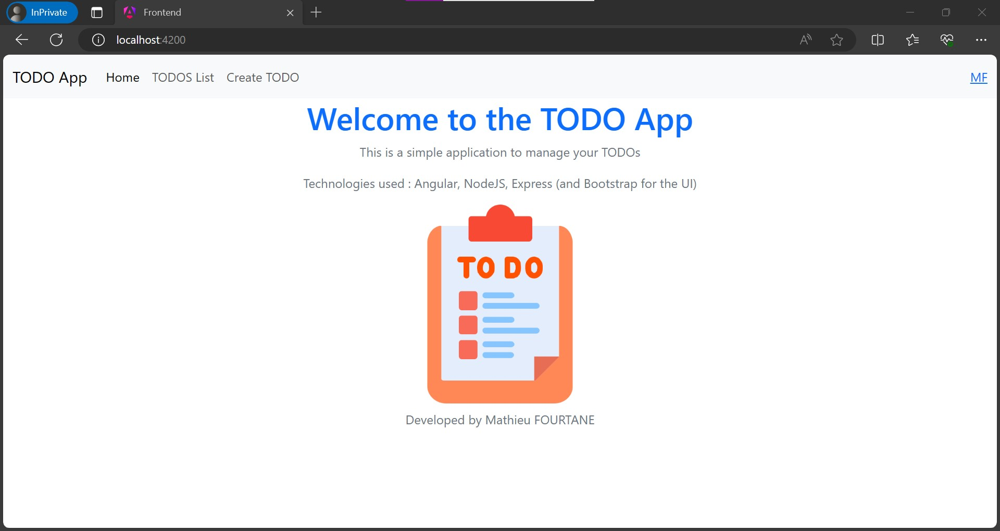
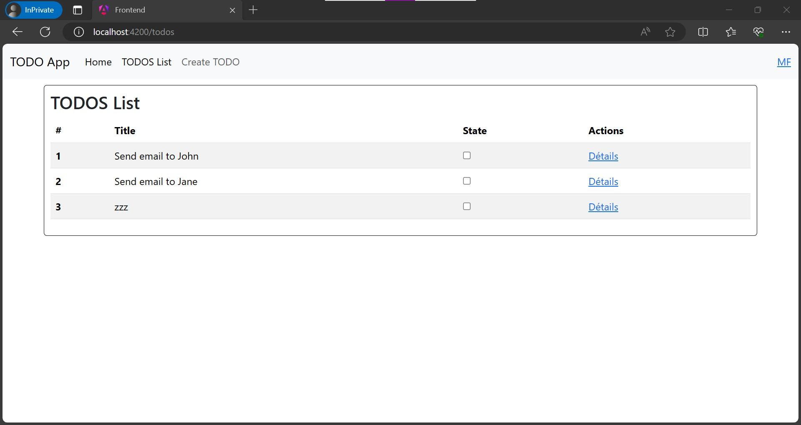
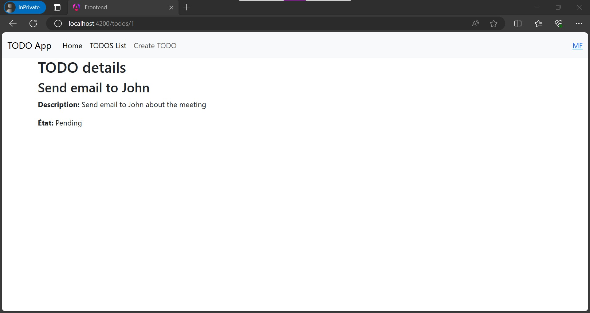
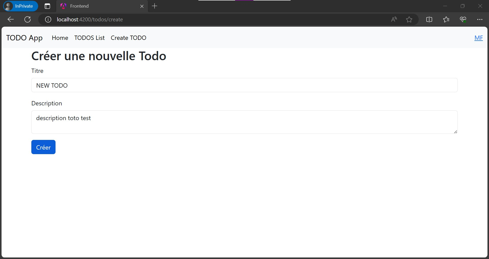
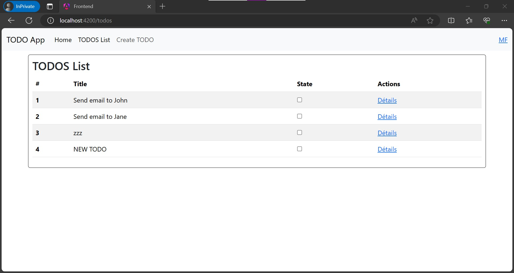

# TODOs Application

### Overview 
This Todo application is a simple yet functional web app designed to manage tasks efficiently. It provides a user-friendly interface to create, view, and manage a list of tasks (todos).

### Features
* **List of Todos** : Users can view all the tasks in a list format. This feature allows users to quickly browse through all their tasks and get an overview of their to-dos. 
----
* **Todo Details**: Each task can be clicked to view more details. This feature enables users to see more information about a specific task, such as its description and status. 
----
* **Create Todo**:Users can add new tasks to their list. This feature includes filling in details like the task's title and description. 
----
* **Update Todo State**: The state of each task can be updated (e.g., from pending to completed) directly from the list view, enhancing the user experience by providing a quick way to update task statuses.
----
### Running the Application

To run this application, follow these steps:

    Backend Setup:
        Navigate to the backend directory: cd backend
        Install dependencies: npm install
        Start the server: npm start

    Frontend Setup:
        Navigate to the frontend directory: cd frontend
        Install dependencies: npm install
        Start the Angular app: ng serve
        Open a browser and go to http://localhost:4200

Feel free to explore and test the functionalities of this Todo application.

### Technologies used
* Angular: Used for building the frontend of the application, providing a responsive and interactive user interface.
* Node.js with Express: Forms the backend of the application, handling API requests and serving the data to the frontend.
* Bootstrap: Utilized for styling the application, ensuring a clean and modern look that is also mobile-responsive.
* Data Storage in JSON: Tasks (todos) are stored in a JSON file, simulating a database in a simple and accessible format: ***\todo_app_angular_nodejs\backend\data\todos.json***

### Screenshots

Below are some snapshots of the application in action:

#### Home

#### List

#### Details

#### Create

#### After Create

